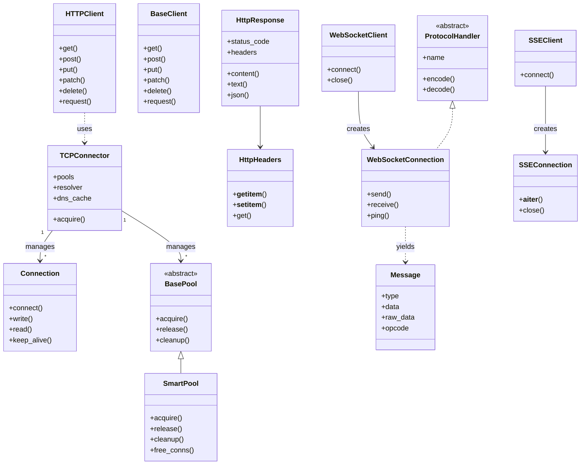

# Agent Instructions for aiosonic

## Build/Lint/Test Commands

### Python Runner

Detect and use the appropriate runner by checking in this order:

| Priority | Condition | Run commands with |
|----------|-----------|-------------------|
| 1 | `uv` is available | `uv run <cmd>` |
| 2 | `poetry` is available | `poetry run <cmd>` |
| 3 | `pipenv` is available | `pipenv run <cmd>` |
| 4 | `./venv/` exists | `./venv/bin/python <cmd>` |
| 5 | `.venv/` exists | `.venv/bin/python <cmd>` |
| 6 | fallback | `python <cmd>` (or as instructed) |

> In the commands below, `<runner>` stands for whichever prefix applies.

### Commands

- **Build**: `<runner> python -m build` or `make build`
- **Test all**: `<runner> py.test`
- **Test single file**: `<runner> py.test tests/test_filename.py`
- **Test single function**: `<runner> py.test tests/test_filename.py::test_function_name`
- **Lint/Format**: `<runner> ruff format .` (formatting), `<runner> ruff check .` (linting)
- **CI test command**: `<runner> py.test --cov-append`
- **Run scripts or examples**: `<runner> python <file.py>`

## After Applying Code Changes

After finishing a set of code changes, always run these checks in order:

1. **Lint**: `<runner> ruff check aiosonic tests aiosonic_utils`
2. **Tests**: `<runner> py.test`

Fix any lint errors or test failures before considering the task done.

## Code Style Guidelines

- **Imports**: Standard library → Third-party → Local (absolute imports, blank lines between groups)
- **Types**: Extensive typing module use (`Dict`, `List`, `Optional`, `Union`, etc.) with full type hints
- **Naming**: Classes=CamelCase, Functions/Methods=snake_case, Constants=UPPER_CASE, Private=_leading_underscore
- **Error Handling**: Custom exceptions in `exceptions.py`, descriptive messages, appropriate try/except
- **Documentation**: Google/NumPy docstring format for all classes and public methods
- **Comments**: DO NOT ADD ***ANY*** COMMENTS in `aiosonic` package functions or classes
- **Formatting**: Ruff formatter (119 char lines, 4 space indent, no trailing whitespace)

## HTTP Client Architecture

## Test Setup

- **Tests location**: `tests/` directory at project root
- **Test files**: Follow `test_*.py` naming convention
- **Node.js servers**: Helper applications in `tests/nodeapps/` (HTTP/1, HTTP/2, WebSocket servers)
- **Test assets**: Certificates in `tests/files/certs/`, sample files in `tests/files/`
- **Pytest plugins**: Uses `pytest-asyncio`, `pytest-cov`, `pytest-timeout`, `pytest-sugar`

### Node.js Helper Servers

| File | Purpose |
|------|---------|
| `tests/nodeapps/http1.mjs` | Basic HTTP endpoints, multipart, compression |
| `tests/nodeapps/http2.js` | HTTP/2 protocol testing |
| `tests/nodeapps/ws-server.mjs` | WebSocket with optional SSL support |
| `tests/nodeapps/sse-server.mjs` | Server-Sent Events testing |

- **Dependencies**: Requires Node.js installed (`brew install node` on macOS)
- **Package management**: `tests/package.json` defines dependencies (`ws` library for WebSockets)
